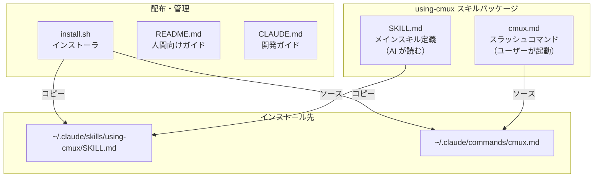
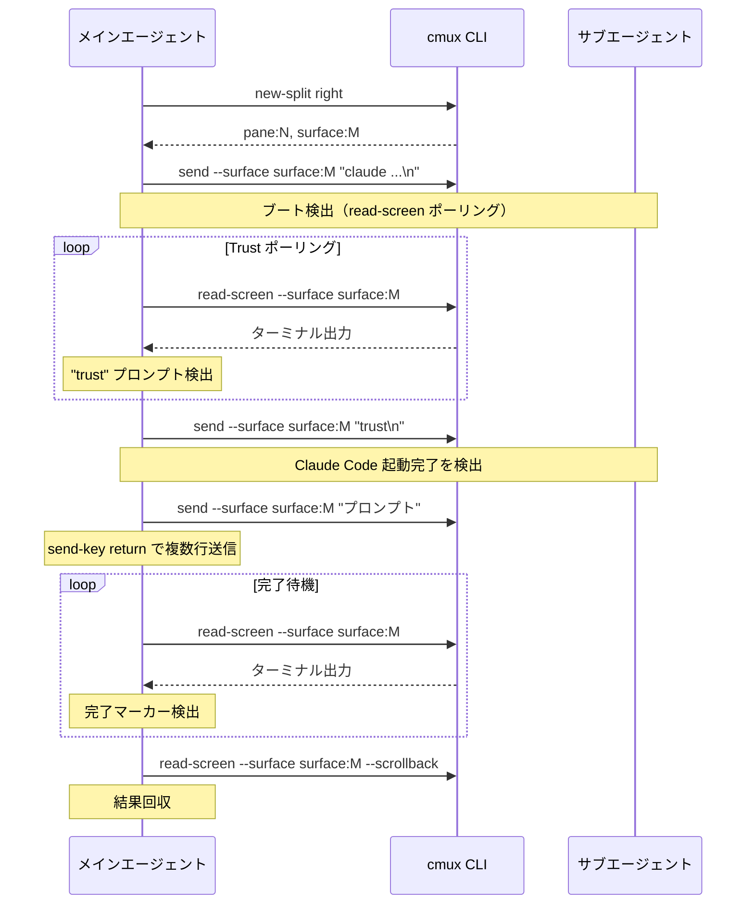
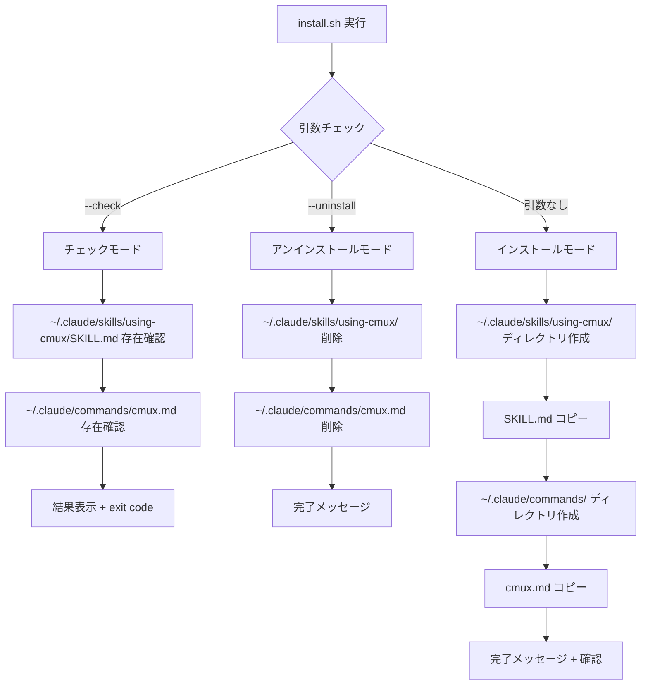

# Output: architect

## Task
要件に基づく技術設計の作成 — using-cmux スキルパッケージ

## Overview

### ゴール
- cmux ターミナル内で AI エージェントが効果的に動作するための実践的スキルパッケージを作成する
- サブエージェント操作（起動→監視→結果回収）を中心に据えた設計
- 既存の hashangit/cmux-skill が持つブラウザ偏重（約50%）を是正し、ターミナル操作・サブエージェントパターンに重点を置く

### ノンゴール
- ブラウザ自動化の包括的リファレンス（5行以内に抑える）
- cmux-team（マルチエージェントオーケストレーション）との機能重複
- cmux の内部実装や API プロトコルの解説

## Architecture

### コンポーネント境界

### データフロー: サブエージェント操作パターン

## File Structure

| ファイル | 役割 | 内容概要 |
|---------|------|---------|
| `.claude/skills/using-cmux/SKILL.md` | メインスキル定義 | AI が自動で読み込むスキルドキュメント。cmux 操作の全知見を構造化して格納 |
| `.claude/commands/cmux.md` | スラッシュコマンド | `/cmux` でユーザーが手動起動。SKILL.md の内容を活用する短いラッパー |
| `install.sh` | インストーラ | `--check`, `--uninstall`, デフォルト（インストール）の3モード |
| `README.md` | 人間向けガイド | インストール方法、使い方、既存スキルとの違い |
| `CLAUDE.md` | 開発ガイド | このリポジトリの開発規約、ファイル構成、テスト方法 |
| `.gitignore` | Git 除外 | `.team/`, `.DS_Store` 等 |
| `LICENSE` | ライセンス | MIT License |

## SKILL.md Structure

全体目安: **約200行**（既存版は318行だがブラウザ部分を大幅削減）

| セクション | 行数目安 | 内容 |
|-----------|---------|------|
| フロントマター (name, description) | 5行 | トリガー条件を含む description |
| `# Using cmux` — 導入 | 3行 | cmux の一言説明、`CMUX_SOCKET_PATH` 検出 |
| `## Quick Orientation` | 10行 | identify, list-workspaces, 階層構造、refs フォーマット |
| `## 基本操作` | 15行 | split, workspace, send, read-screen, close のクイックリファレンス |
| `## send の改行ルール` ★最重要 | 15行 | 単一行: `\n` OK、複数行: `send-key return` 必須。具体例付き |
| `## サブエージェント操作パターン` ★中核 | 50行 | 1体の起動→Trust検出→プロンプト送信→完了検出→結果回収。ステップバイステップ |
| `## read-screen トラブルシューティング` | 15行 | refresh-surfaces、--scrollback、出力が空の場合の対処 |
| `## ロングラン実行の監視` | 15行 | dev server/build の起動と非同期監視パターン |
| `## 通知` | 15行 | cmux notify vs osascript の使い分けマトリクス |
| `## ステータス・プログレス表示` | 10行 | set-status, set-progress, clear-status の例 |
| `## ブラウザ` | 5行 | 最小限。`cmux browser --help` 参照の案内のみ |
| `## 環境変数` | 8行 | CMUX_SOCKET_PATH, CMUX_WORKSPACE_ID, CMUX_SURFACE_ID |
| `## よくあるミス` | 15行 | テーブル形式で改行問題、UUID vs refs、同一ワークスペース配置等 |
| `## コマンドクイックリファレンス` | 20行 | テーブル形式の全コマンド一覧（ブラウザ除く） |

### 既存版との主な違い

| 観点 | 既存版 (hashangit) | 新版 |
|------|-------------------|------|
| ブラウザ操作 | ~150行（約50%） | 5行（参照のみ） |
| サブエージェント操作 | なし | ~50行（中核セクション） |
| send の改行ルール | 簡易的 | 専用セクション（具体例付き） |
| read-screen トラブル | なし | 専用セクション |
| ロングラン監視 | なし | 専用セクション |
| 通知 | 詳細 | 同等（使い分けマトリクス維持） |

## install.sh Design

### インストールフロー

### 設計方針
- **べき等性**: 何度実行しても同じ結果
- **ソースパス解決**: `SCRIPT_DIR` を `$0` から解決し、リポジトリ内のファイルを参照
- **既存ファイルの扱い**: 上書き（バックアップなし — git 管理前提）
- **依存**: bash のみ（外部ツール不要）
- **exit code**: `--check` 時、未インストールなら exit 1

## Technology Choices

| 選択 | 理由 |
|------|------|
| 純 bash (install.sh) | 依存ゼロ。macOS 標準環境で動作。cmux ユーザーは macOS 前提 |
| Markdown (SKILL.md) | Claude Code のスキルシステム標準形式。フロントマター (YAML) + Markdown 本文 |
| Mermaid なし (SKILL.md 内) | AI が読むドキュメントなので図表は不要。テーブルとコード例で十分 |
| MIT License | OSS 標準。既存 cmux-skill も MIT |
| テーブル形式のリファレンス | AI が効率的にパースできる。散文より構造化データが有効 |

## Implementation Strategy

### フェーズ分け

```mermaid
gantt
    title 実装フェーズ
    dateFormat X
    axisFormat %s

    section Phase 1: コア
    SKILL.md 作成           :p1, 0, 3
    cmux.md 作成            :p2, 0, 1

    section Phase 2: 配布
    install.sh 作成         :p3, 3, 2
    CLAUDE.md 作成          :p4, 3, 1

    section Phase 3: 仕上げ
    README.md 作成          :p5, 5, 1
    .gitignore / LICENSE    :p6, 5, 1
```

### Phase 1: コア（最優先）
1. **SKILL.md** — スキル定義本体。全要件の中核
   - send の改行ルールセクションを最初に書く（最重要）
   - サブエージェント操作パターンを次に書く（中核）
   - 残りのセクションを優先度順に追加
2. **cmux.md** — `/cmux` コマンド。SKILL.md に依存

### Phase 2: 配布
3. **install.sh** — SKILL.md と cmux.md が確定してから作成
4. **CLAUDE.md** — 開発ガイド

### Phase 3: 仕上げ
5. **README.md** — 全体が確定してから作成
6. **.gitignore**, **LICENSE** — 定型ファイル

### 依存関係
- cmux.md → SKILL.md（内容を参照）
- install.sh → SKILL.md, cmux.md（コピー対象）
- README.md → 全ファイル（説明対象）
- CLAUDE.md → ファイル構成確定後

## Risks and Mitigations

| リスク | 影響 | 緩和策 |
|--------|------|--------|
| cmux CLI の API 変更 | SKILL.md のコマンド例が陳腐化 | `cmux --help` ベースで最新コマンドを確認。バージョン依存を明記しない（常に最新前提） |
| cmux-team との機能重複 | ユーザー混乱、メンテ二重化 | using-cmux は「1体のサブエージェント操作」に限定。マルチエージェントは cmux-team の責務 |
| サブエージェントの Trust フロー変更 | ブート検出パターンが壊れる | Trust 検出を汎用的に記述（特定文字列ではなく「trust / permissions プロンプトの検出」として記載） |
| SKILL.md が長すぎると AI のコンテキストを圧迫 | スキル読み込みのコスト増 | 200行以内に抑える。ブラウザ操作を大幅削減。テーブル形式で密度を上げる |
| 既存 using-cmux スキルとの共存 | インストール先が同じパスで衝突 | install.sh で上書き前に既存版を検出し、警告メッセージを表示 |

## Recommendations

1. **SKILL.md は「レシピ集」として構成する** — 抽象的な説明より、コピペ可能な具体例を中心に。AI は具体例からパターンを抽出するのが得意
2. **サブエージェント操作パターンは「チェックリスト形式」で** — 手順を番号付きリストにし、各ステップで実行するコマンドと期待結果を明示
3. **`--dangerously-skip-permissions` の記載** — サブエージェント起動時によく使うフラグだが、セキュリティリスクの注記を添える
4. **install.sh に `--check` の exit code** — CI/CD やセットアップスクリプトから利用可能にする

## Issues Raised
なし — 要件は十分に明確。
