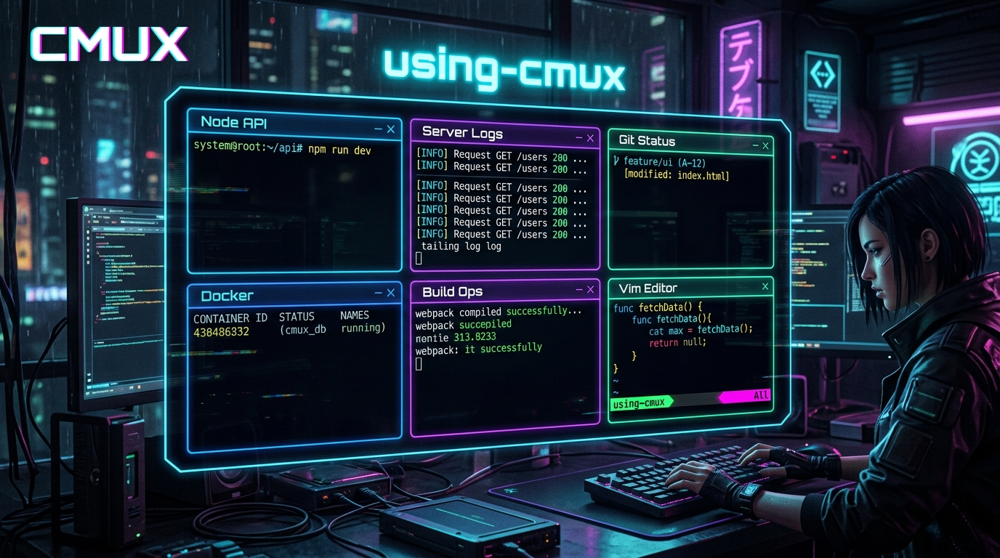
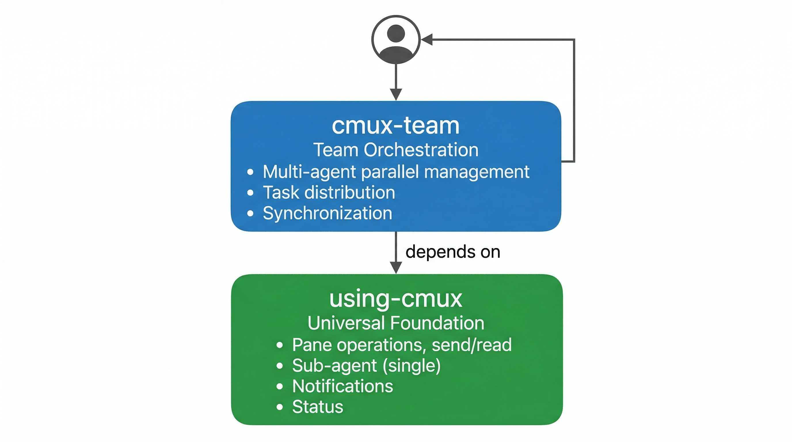

日本語 | **[English](README.md)**



# using-cmux

AI が cmux を操作するための Claude Code スキルパッケージ。

## モチベーション

Claude Code の組み込み `Agent` ツールは便利だが、内部で何が起きているかが見えない。サブエージェントの出力を確認したり、途中で介入したりすることが困難で、デバッグや品質管理が難しい。

**cmux を使えば、すべてが見える。** ターミナルマルチプレクサとして動作する cmux 上でサブエージェントを起動すれば、各エージェントの入出力をリアルタイムに確認でき、いつでも介入・修正できる。

既存の [hashangit/cmux-skill](https://github.com/hashangit/cmux-skill) はブラウザ自動化の記述が全体の約50%を占めており、サブエージェント操作という本来最も重要なユースケースが埋もれていた。本パッケージはその構成を見直し、**サブエージェント操作パターンを中核に据え直した**代替スキルである。

## 概要

このスキルは以下の内容をカバーする:

| カテゴリ | 内容 |
|---------|------|
| **基本操作** | ペイン分割、ワークスペース管理、コマンド送信、画面読み取り |
| **send の改行ルール** | 最も重要なルール。単一行の `\n` と複数行の `send-key return` の使い分け |
| **サブエージェント起動パターン** | 起動 → Trust検出 → プロンプト送信 → 完了検出 → 結果回収の一連の手順 |
| **read-screen トラブルシューティング** | 出力が空・古い場合の `refresh-surfaces` 等の対処法 |
| **通知** | `cmux notify`（アプリ内）と `osascript`（macOS通知センター）の使い分け |
| **ステータス・プログレス表示** | サイドバーステータスとプログレスバーの制御 |

## cmux-team との関係



- **using-cmux**: cmux CLI の汎用操作スキル。1体のサブエージェントの起動から結果回収までをカバー
- **cmux-team**: 複数エージェントのオーケストレーション。チーム構成・タスク分配・同期を担当。using-cmux の操作パターンを基盤として利用する

## 前提条件

- [Claude Code](https://docs.anthropic.com/en/docs/claude-code) がインストール済みであること
- [cmux](https://cmux.dev) がインストール済みで、cmux セッション内で Claude Code を実行すること

## インストール

### 方法1: Plugin（推奨）

```
/plugin marketplace add hummer98/using-cmux
/plugin install using-cmux
```

スキル・コマンド・フックがまとめてインストールされる。

**アップデート:**

```
/plugin update using-cmux
/reload-plugins
```

### 方法2: Agent Skills（スキルのみ）

```bash
npx skills add hummer98/using-cmux
```

> 注: Agent Skills ではコマンド（`/cmux`）は含まれない。

### 方法3: 手動（レガシー）

```bash
git clone https://github.com/hummer98/using-cmux.git
cd using-cmux
bash install.sh
```

以下のファイルがインストールされる:

| インストール先 | 内容 |
|---------------|------|
| `~/.claude/skills/using-cmux/SKILL.md` | メインスキル定義（Claude Code が自動読み込み） |
| `~/.claude/commands/cmux.md` | `/cmux` スラッシュコマンド |

### インストール確認（手動のみ）

```bash
bash install.sh --check
```

### アンインストール（手動のみ）

```bash
bash install.sh --uninstall
```

## 使い方

### スキルの自動トリガー

cmux セッション内で Claude Code を起動すると、環境変数 `CMUX_SOCKET_PATH` の存在を検出してスキルが自動的にロードされる。特別な操作は不要。

Claude Code が cmux 操作の指示を受けると、SKILL.md に記述されたパターンに従って、ペイン分割・コマンド送信・サブエージェント起動などを実行する。

### `/cmux` コマンド

クイックリファレンスを表示する:

```
/cmux
```

コマンド一覧・基本的な使い方を手早く確認したいときに使う。

## ライセンス

[MIT](LICENSE)
